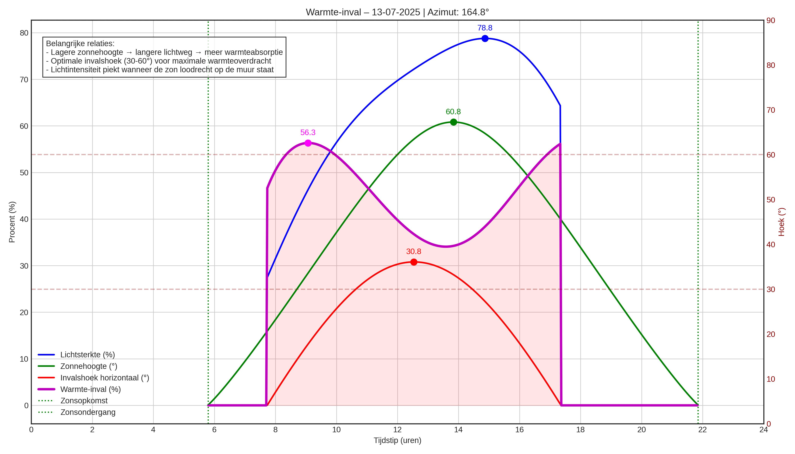

# Wall Sunlight Analyzer

A Python tool for analyzing sunlight angles, intensity, and heat gain on walls with different orientations. Provides visualizations of daily and yearly solar patterns.

## Features

- Calculates solar angles (azimuth, elevation, angle of attack)
- Computes light intensity and heat gain on vertical surfaces
- Visualizes daily solar profiles
- Compares seasonal heat gain patterns
- Supports multiple languages (Dutch/English)

## Installation

1. Clone the repository:
```bash
git clone https://github.com/yourusername/wall-sunlight-analyzer.git
cd wall-sunlight-analyzer
```

2. Install dependencies:

```bash

pip install -r requirements.txt

```

Dependencies

    Python 3.8+

    matplotlib

    numpy

    pandas

    pvlib

## Usage
```python
from datetime import datetime
from sun_analyser import WallSunlightAnalyzer

# Initialize analyzer for a wall in Aalst, Belgium (azimuth 164.8°)
analyzer = WallSunlightAnalyzer(
    latitude=50.9383,
    longitude=4.0393,
    wall_azimuth=164.8,
    language='nl'  # 'nl' for Dutch, 'en' for English
)

# Analyze a specific date
date = datetime(2025, 7, 13)

# Get sunlight hitting times
hit_start, hit_end = analyzer.calculate_hitting_time(date)
print(f"Sun hits wall from {hit_start.strftime('%H:%M')} to {hit_end.strftime('%H:%M')}")

# Generate visualizations
analyzer.plot_daily_profile(date)  # 4-panel detailed view
analyzer.plot_comprehensive_daily_profile(date)  # Combined view
```
## Methods
### Core Calculations

    calculate_angles(dt): Get solar position and angle of attack

    calculate_hitting_time(date): Returns (start, end) times when sun hits wall

    _calculate_heat_gain(info): Computes thermal impact (0-100%)

### Visualizations

    plot_daily_profile(date): 4-panel detailed daily analysis

    plot_comprehensive_daily_profile(date): Combined metrics view

## Example Plot


